# exam-study-hub 家庭 Mac + Cloudflare Tunnel 部署实操教程

这份教程记录了 `exam-study-hub` 在一台 Apple 芯片家庭 Mac 上的实际部署过程。最终公网地址是：

> [https://study.hongchangli.xyz](https://study.hongchangli.xyz)

当前请求路径如下：

```text
访问者浏览器
    ↓ HTTPS
Cloudflare（DNS、证书、代理）
    ↓ Cloudflare Tunnel
家庭 Mac：127.0.0.1:8080（Nginx）
    ├── 前端 dist 静态文件
    └── /api/ → 127.0.0.1:8000（FastAPI）
                    ↓
                PostgreSQL 16
```

这种方式不需要家庭宽带拥有公网 IP，也不需要在路由器上开放 80、443 端口。

## 一、最终配置

| 项目 | 当前配置 |
|---|---|
| 域名注册商 | 阿里云 |
| 根域名 | `hongchangli.xyz` |
| 公网子域名 | `study.hongchangli.xyz` |
| Cloudflare 套餐 | Free |
| Tunnel 名称 | `exam-study-hub-mac` |
| Tunnel 本地目标 | `http://127.0.0.1:8080` |
| Nginx | `127.0.0.1:8080` |
| FastAPI | `127.0.0.1:8000` |
| PostgreSQL | PostgreSQL 16 |

## 二、先确认 Mac 本地服务

在配置公网域名之前，先确认本机可以打开：

```text
http://127.0.0.1:8080
```

并检查后端健康接口：

```bash
curl http://127.0.0.1:8080/api/health
```

正常结果应包含：

```json
{"code":0,"message":"success","data":{"status":"ok"}}
```

当前 Mac 使用下列后台服务：

- `postgresql@16`：数据库。
- `com.lihongchang.exam-study-hub-server`：FastAPI 后端。
- `nginx`：网页服务器和 API 反向代理。
- `com.cloudflare.cloudflared`：Cloudflare Tunnel。

日常只需要保持 Mac 开机并联网。这些服务正常运行时，公网地址才能访问。

## 三、把域名添加到 Cloudflare

登录 Cloudflare 后进入“网站”，点击“添加域”。

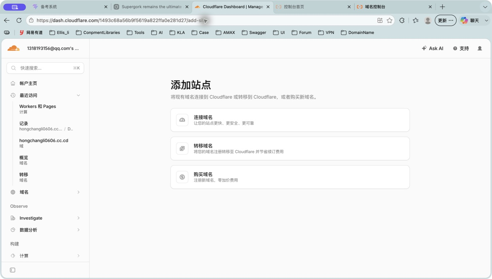

输入根域名：

```text
hongchangli.xyz
```

不要在这里输入 `study.hongchangli.xyz`，也不要加 `https://`。

选择 Free 免费套餐即可。

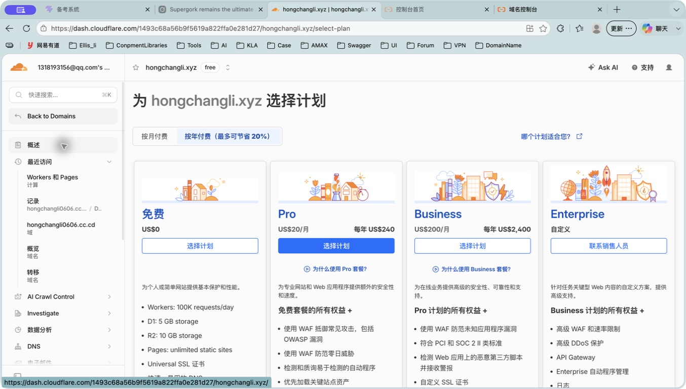

Cloudflare 会分配两条名称服务器。本次实际分配的是：

```text
drake.ns.cloudflare.com
magali.ns.cloudflare.com
```

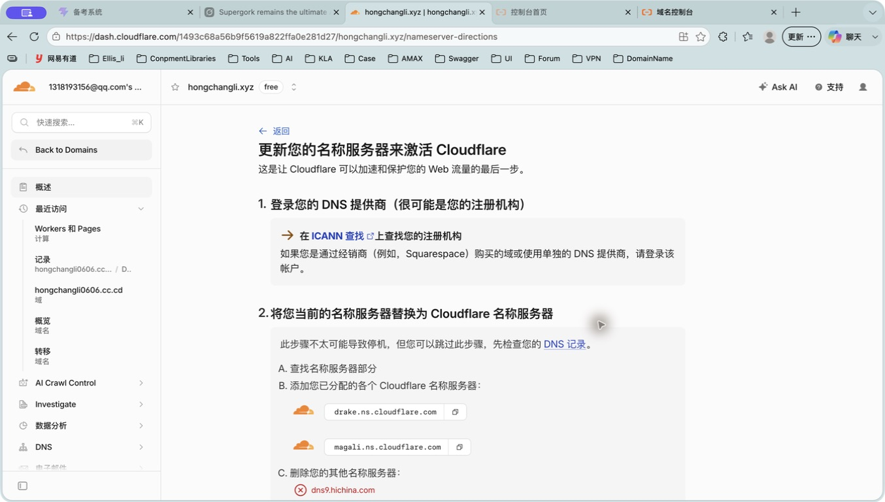

## 四、在阿里云修改名称服务器

进入阿里云“域名控制台 → hongchangli.xyz → DNS 修改”，点击“修改 DNS 服务器”。

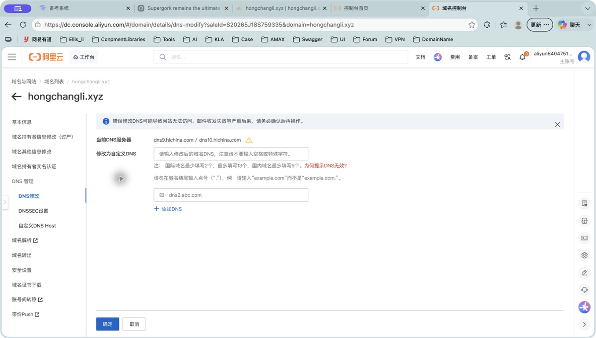

用 Cloudflare 提供的两条地址替换阿里云原来的名称服务器：

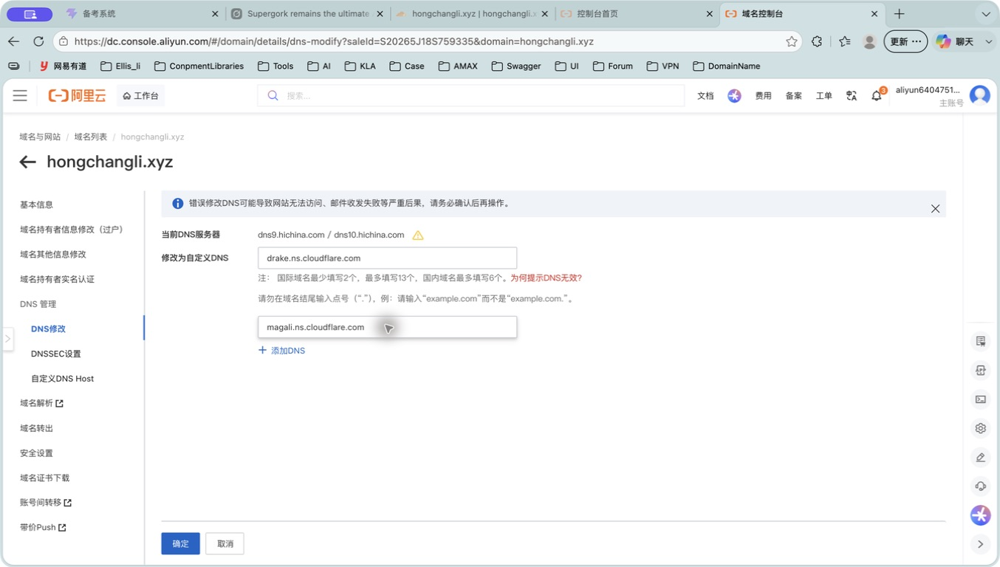

提交时阿里云可能要求短信验证，验证码必须由域名持有人本人填写。保存成功后，阿里云页面会显示新的名称服务器：

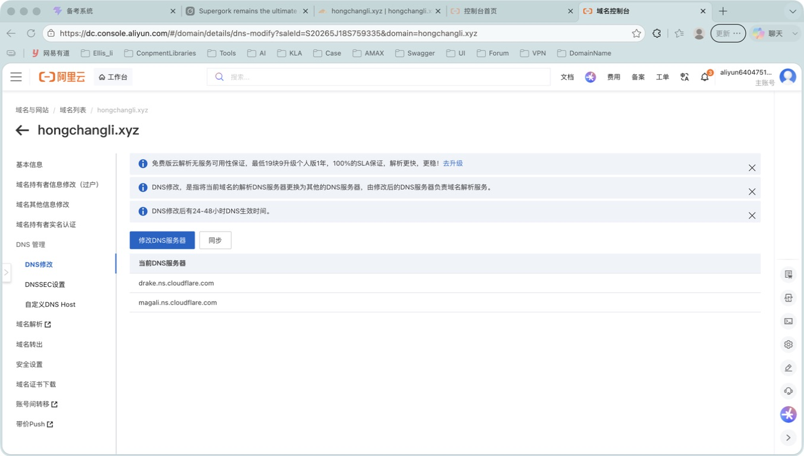

回到 Cloudflare 点击“我已更新名称服务器”。随后可能看到“正在等待注册机构传播新的名称服务器”：

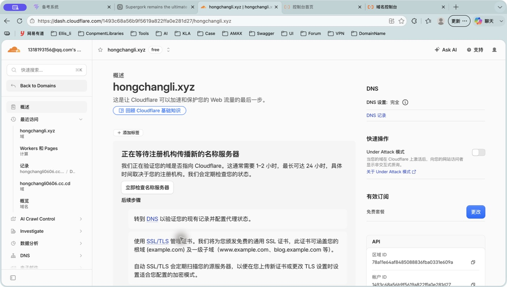

这个阶段通常需要 1～2 小时，最长可能达到 24 小时。重复点击检查不会加速传播。

当 `hongchangli.xyz` 能出现在 Tunnel 的“域”下拉框中时，说明已经可以继续。

## 五、使用现有 Cloudflare Tunnel

进入：

```text
Cloudflare One
→ 网络
→ 连接器
→ exam-study-hub-mac
→ 已发布应用程序路由
```

本次使用现有 Tunnel，不需要重新创建 Tunnel，也不需要重新安装 `cloudflared`。

如果列表为空，点击“添加已发布应用程序路由”。

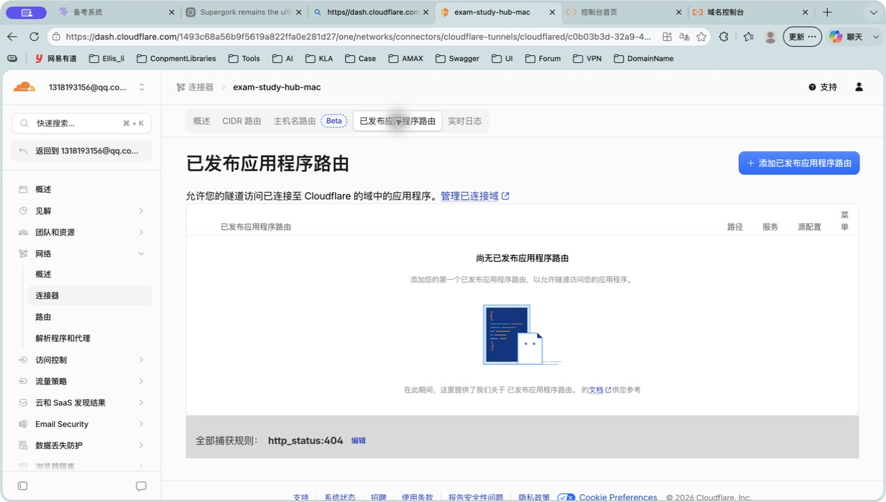

表单填写如下：

| 字段 | 填写内容 |
|---|---|
| 子域名 | `study` |
| 域 | `hongchangli.xyz` |
| 路径 | 留空 |
| 类型 | `HTTP` |
| URL | `127.0.0.1:8080` |

填写完成后，完整主机名应当是：

```text
study.hongchangli.xyz
```

本地服务应当是：

```text
http://127.0.0.1:8080
```

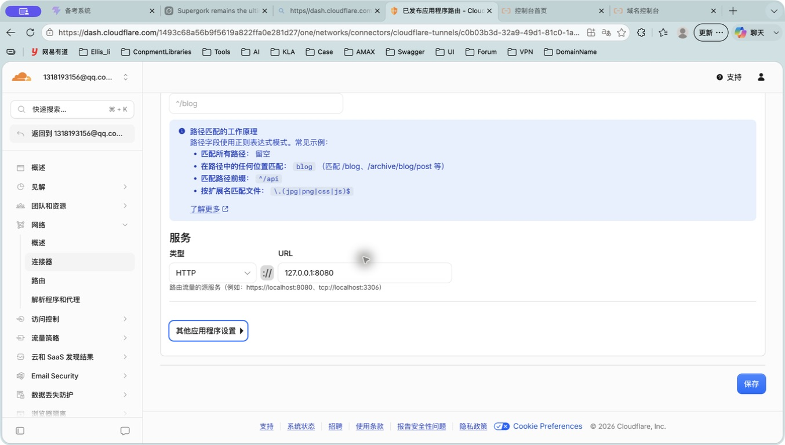

> 注意：URL 输入框中的冒号必须是英文半角 `:`，不能使用中文全角 `：`。

点击“保存”会把系统正式发布到互联网。保存成功后，路由列表应显示：

```text
study.hongchangli.xyz  →  http://127.0.0.1:8080
```

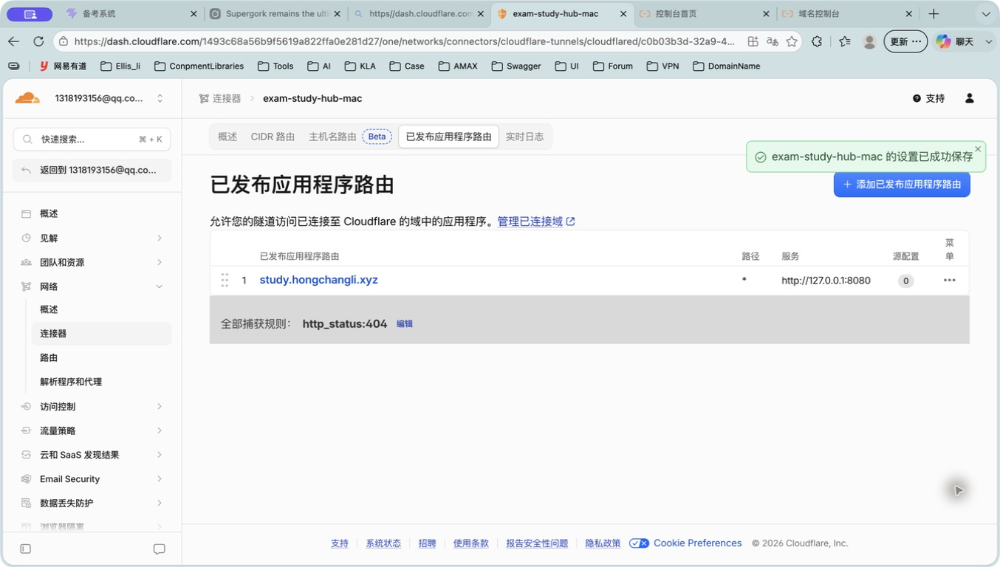

## 六、验证部署结果

在浏览器打开：

```text
https://study.hongchangli.xyz
```

能够看到备考系统登录页，就说明前端、Nginx、Tunnel、DNS 和 HTTPS 都已连通。

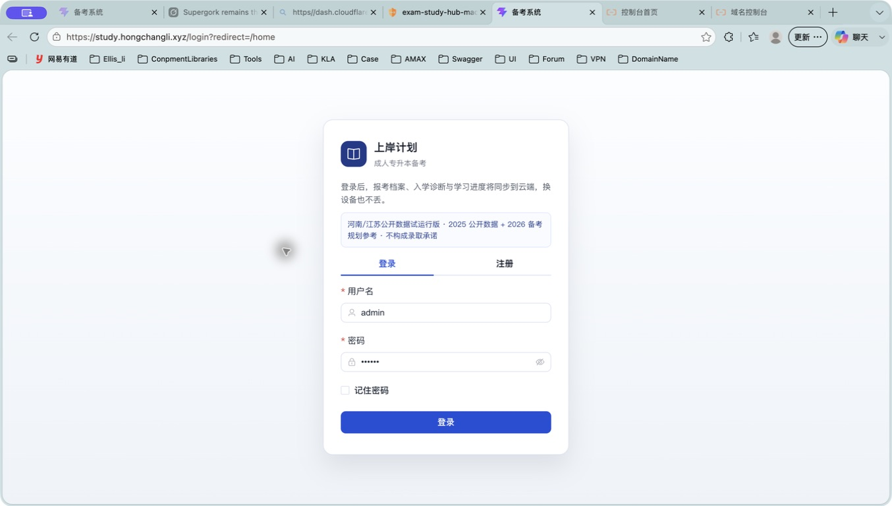

再验证后端：

```bash
curl https://study.hongchangli.xyz/api/health
```

应返回：

```json
{"code":0,"message":"success","data":{"status":"ok"}}
```

## 七、日常使用

### 正常访问需要满足

1. 家庭 Mac 已开机，且没有进入断网状态。
2. PostgreSQL 正在运行。
3. FastAPI 后端正在运行。
4. Nginx 正在运行。
5. `cloudflared` Tunnel 正在运行。

Mac 关机、休眠断网或任意关键服务停止时，公网网站都会暂时打不开；重新开机并恢复服务后，域名不需要重新配置。

### 常用检查命令

```bash
# 检查本机网页
curl -I http://127.0.0.1:8080

# 检查本机后端
curl http://127.0.0.1:8080/api/health

# 查看 Homebrew 服务
brew services list

# 检查 Nginx 配置
nginx -t
```

公网检查：

```bash
curl -I https://study.hongchangli.xyz
curl https://study.hongchangli.xyz/api/health
```

## 八、常见问题

### 1. Cloudflare 的“域”下拉框是空的

通常是名称服务器还没有传播完成。先检查阿里云是否已经显示 Cloudflare 的两条名称服务器，再等待 Cloudflare 把域名状态变为活动。

### 2. 提示“URL 为必填项”

即使文字看起来已经在输入框内，浏览器自动填写也可能没有触发表单校验。点击 URL 输入框，手动重新输入：

```text
127.0.0.1:8080
```

### 3. 提示“服务 URL 无效”

检查冒号是不是英文半角 `:`。正确与错误示例：

```text
正确：127.0.0.1:8080
错误：127.0.0.1：8080
```

### 4. 网页能打开，但登录或数据功能失败

这通常说明前端和 Nginx 正常，但 FastAPI 或 PostgreSQL 没有运行。先检查：

```text
http://127.0.0.1:8080/api/health
```

### 5. 出现 502 Bad Gateway

Tunnel 能到达 Mac，但 Nginx 或后端服务没有正常响应。依次检查本机 `8080` 和 `/api/health`。

### 6. 外网偶尔刚开始打不开

刚保存路由或刚激活域名时，DNS 和 HTTPS 证书可能需要短暂同步。等待一两分钟后刷新即可。

## 九、安全提醒

- 不要把 Cloudflare Tunnel Token、数据库密码、短信验证码写进教程或提交到 Git。
- 公开域名意味着任何人都能访问登录页，应使用强密码。
- 如果只想自己使用，可以后续配置 Cloudflare Access，在网站前再增加邮箱验证码或身份登录。
- 域名到期前记得续费，否则公网地址会失效。

## 十、本次部署结果

- 网站首页：`https://study.hongchangli.xyz`，HTTP 状态码 `200`。
- 后端健康检查：`https://study.hongchangli.xyz/api/health`，状态为 `ok`。
- Cloudflare Tunnel：`exam-study-hub-mac`，已连接。
- 公网 HTTPS：已生效。

